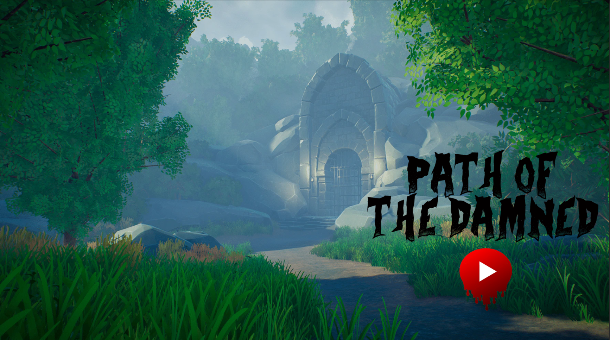
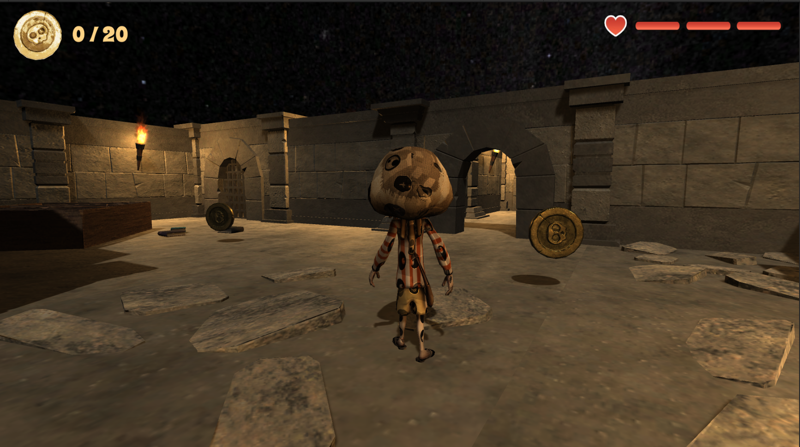
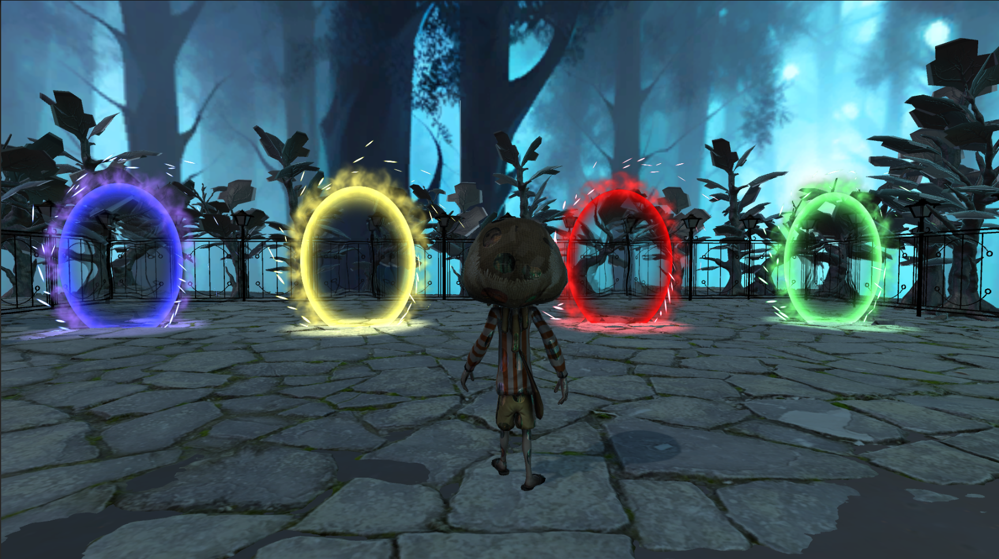

# Path of the Damned 

# _3D Dungeon  Game_

[](https://unity3d.com)  

## Description

Welcome to the Game! This Unity project generates a 3D procedural dungeon with connected rooms, where players can explore, interact with objects, and fight enemies. The game demonstrates procedural generation, AI pathfinding, and basic combat mechanics.

## Features

- Procedurally generated connected 5 Dungeon rooms.
- Player movement with a third-person camera.
- Enemies start to follow and attack the player when the player gets close, with a defined chase range.
- Random object spawning in rooms (coins and health items).
- Lighting with post-processing effects for improved visuals.
- Simple and easy-to-extend code structure.

## Step 1: Player Movement
- Implemented basic player movement using Unity's **CharacterController** for a third-person view.
- Set up a **third-person camera** to follow the player, allowing smooth control and exploration of the dungeon.
- Player can Walk, Run and Jump.

## Step 2: Enemy AI, Chase Range, Coins & Healing
- Created enemy AI using Unity's **NavMesh** system.
- Set a **chase range** for enemies. When the player gets within this range, enemies follow and attack the player.
- Randomly spawned **coins** and **healing items** in rooms to allow for object interaction and resource collection.
  

## Step 3: Audio and Lighting
- Added **lighting** to enhance the atmosphere of the dungeon, including ambient lights and directional lights in each room.
- Applied **post-processing effects** such as bloom and color grading to improve the overall visual quality.
- Included **audio** for player movement, enemy attacks, and ambient sounds to create an immersive experience.


## Final Stage with Magic Doors
- In the **final stage** of the dungeon 5, added **4 magic doors**.
- Each of these doors connects back to the rooms that the player previously explored in the dungeon.


## Installation Instructions

1. Clone the repository:
   ```bash
   git clone https://github.com/DharaneeshAM/Path-of-the-Damned.git